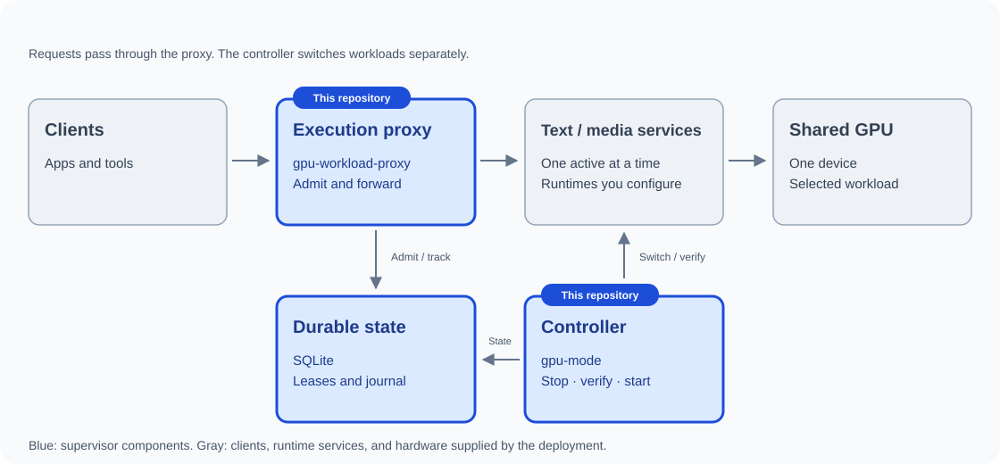

# GPU Workload Supervisor

GPU Workload Supervisor switches between text and media workloads that share one GPU. It stops and verifies the outgoing workload before starting the next, and blocks new requests when a transition or recovery fails. Use it when both workloads cannot safely run at once.

It provides a controller (`gpu-mode`) and an execution proxy (`gpu-workload-proxy`). You supply the runtime services, health endpoints and deployment configuration.

## How it fits together

<a href="docs/ARCHITECTURE.md">
  <picture>
    <source media="(prefers-color-scheme: dark)" srcset="docs/architecture/generated/overview-dark.svg">
    <source media="(prefers-color-scheme: light)" srcset="docs/architecture/generated/overview-light.svg">
    
  </picture>
</a>

[Explore state and responsibilities](docs/ARCHITECTURE.md) | [Execution proxy details](docs/EXECUTION-PROXY.md)

## Install

Download the Linux amd64 or arm64 archive from [Releases](https://github.com/mickey-kras/gpu-workload-supervisor/releases), verify it against the release checksum file, and extract both binaries into a version-specific directory. Use their absolute paths in commands and services. See [release verification](docs/RELEASING.md) and [backup before upgrading](docs/RESTORING.md#back-up-before-an-upgrade).

Requires Linux with user-systemd and cgroup v2. Direct runtime requests bypass the supervisor, so deployment must prevent that bypass.

## Set up your workloads

Follow [deployment setup](docs/DEPLOYMENT.md) to configure the two runtime services, a private durable state directory and health checks. The guide includes the full controller command and release-verification requirements.

Then [reconcile at boot](docs/OPERATIONS.md#boot-and-explicit-recovery), configure the [execution proxy](docs/EXECUTION-PROXY.md), and complete [host qualification](docs/DEPLOYMENT.md#qualify-the-host) before enabling requests. New state starts closed; failed transitions require explicit operator recovery.

## Documentation

- [Deploy and qualify a host](docs/DEPLOYMENT.md)
- [Switch workloads, transfer ownership and recover](docs/OPERATIONS.md)
- [Back up and restore](docs/RESTORING.md)
- [All documentation](docs/README.md), including development, contracts and releases

[MIT license](LICENSE).

